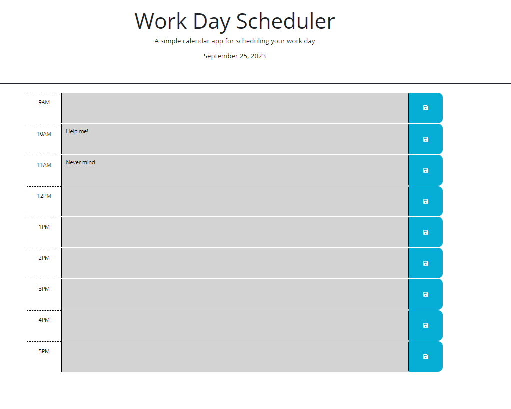

# Week 5 Challenge - Calendar

## Description

This week's assignment was another refactor, this time the goal was to make a timesheet that allowed users to record planned tasks in an 8-hour work day. This way, even if an individual refreshes or leaves the page, their recorded tasks will remain in their intended spots. The application should also inform the user of what hour they are currently on.

This was a pretty simple project, especially considering the previous weeks. It served as a nice intro to interacting with Bootstrap elements as well as communicating with jQuery. The languages of both haven't quite settled in with me yet (this was a cursory task after all), but it's at least a simple way to ease into them.

## Screenshot

## Link to Deployed Application

https://chasinggatsby.github.io/w5c-calendar/
